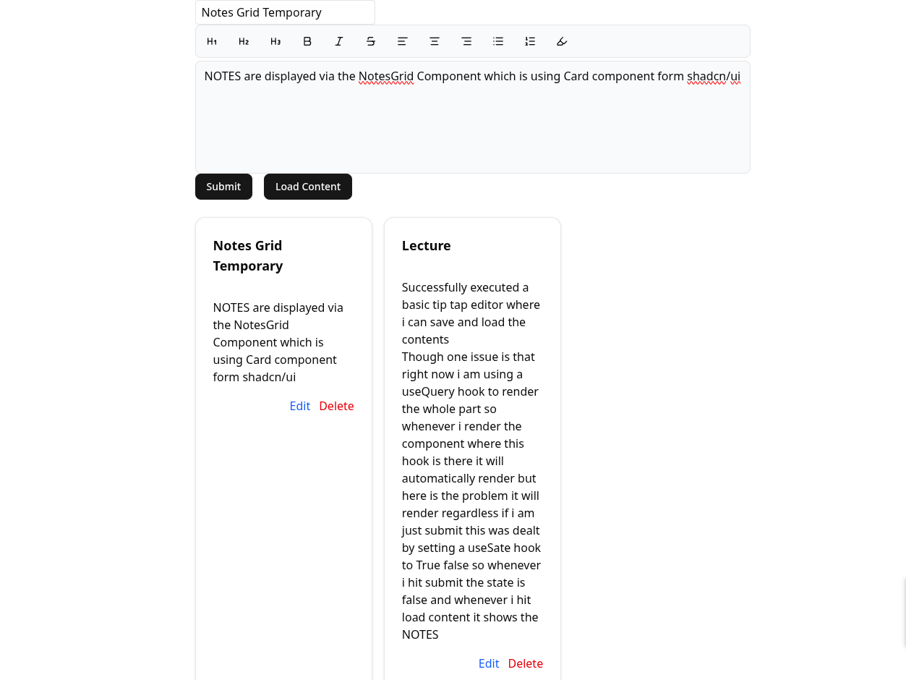

## 📝 Next.js + TipTap + Convex Demo

A demo project showcasing a rich text editor built with Next.js, TipTap, shadcn/ui, and Convex for real‑time persistence.

#### This project demonstrates how to:
Integrate TipTap into a Next.js app

Style the editor with shadcn/ui components

Save and load editor content using Convex mutations & queries

Round‑trip persistence (type → save → reload → load)

#### 🚀 Features
✨ Next.js app scaffolded with TypeScript

🎨 UI powered by shadcn/ui

🖋️ Rich text editing via TipTap (bold, italic, etc.)

💾 Save & Load buttons wired to Convex backend

🔄 Verified persistence (save → reload → load works)


<details>
<summary><strong>📁 Project Structure</strong></summary>

<br/>

```
📦 tip_tap_editor
├── app/
│   └── page.tsx
├── components/
│   ├── rich-text-editor/
│   └── ui/
├── convex/
└── screenshots/
```

</details>


## 🖼️ Screenshot




⚙️ Setup & Run
1️⃣ Clone the repository
<details> <summary><strong>Show instructions</strong></summary> <br/>
git clone https://github.com/your-username/tip_tap_editor.git
cd tip_tap_editor

</details>
2️⃣ Install dependencies
<details> <summary><strong>Show instructions</strong></summary> <br/>
npm install

</details>
3️⃣ Run Convex dev server
<details> <summary><strong>Show instructions</strong></summary> <br/>
npx convex dev


⚠️ Run this command in a separate terminal

</details>
4️⃣ Start the Next.js app
<details> <summary><strong>Show instructions</strong></summary> <br/>
npm run dev

</details>
5️⃣ Open in browser
<details> <summary><strong>Show instructions</strong></summary> <br/>

👉 Visit: http://localhost:3000

</details>
